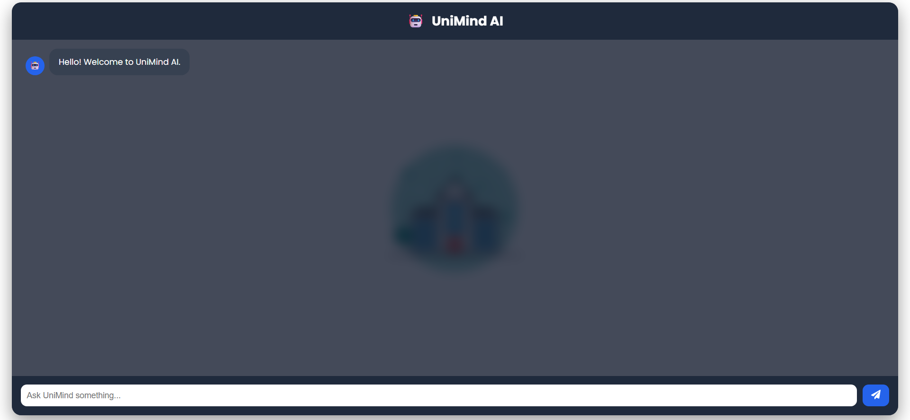
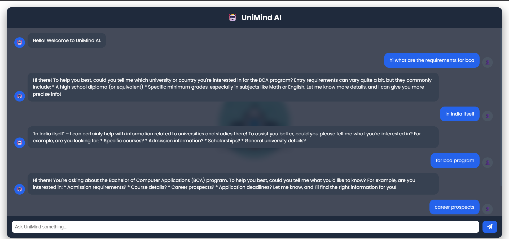

# UniMind AI 🎓🤖

UniMind AI is a full-stack AI-powered university assistance platform that helps students get instant answers to academic and campus-related queries using Google's Gemini AI.

The application combines a React frontend, FastAPI backend, SQLite database, and Gemini AI to deliver a conversational support experience while storing interactions for future analytics and reporting.

## Key Features

✅ AI-powered chatbot using Google Gemini AI

✅ FastAPI REST API backend

✅ Responsive React user interface

✅ SQLite database integration

✅ Chat history logging

✅ Mobile-friendly design

✅ Modular backend architecture

## Tech Stack

| Layer           | Technology         |
| --------------- | ------------------ |
| Frontend        | React, Vite, Axios |
| Backend         | FastAPI, Python    |
| Database        | SQLite, SQLAlchemy |
| AI              | Google Gemini API  |
| Version Control | Git, GitHub        |

## System Architecture

User → React Frontend → FastAPI API → Gemini AI → Response

```
                         ↓

                    SQLite Database
```

## Project Structure

backend/

├── app/

│   ├── database/

│   ├── routes/

│   ├── services/

│   └── main.py

├── .env

└── requirements.txt

frontend/

├── src/

├── public/

└── package.json

## Installation

### Backend

```bash
cd backend
pip install -r requirements.txt
python -m uvicorn app.main:app --reload
```

### Frontend

```bash
cd frontend
npm install
npm run dev
```
## Application Preview

### Home Screen



### Chat Interaction



## What I Learned

* Building REST APIs using FastAPI
* Integrating Generative AI APIs
* Database design with SQLite and SQLAlchemy
* Frontend-backend communication using Axios
* Environment variable management
* Git and GitHub workflows

## Future Enhancements

* User authentication
* Student login portal
* Conversation history dashboard
* University-specific knowledge base
* Analytics and reporting module

## Author

Pritha Gautam
